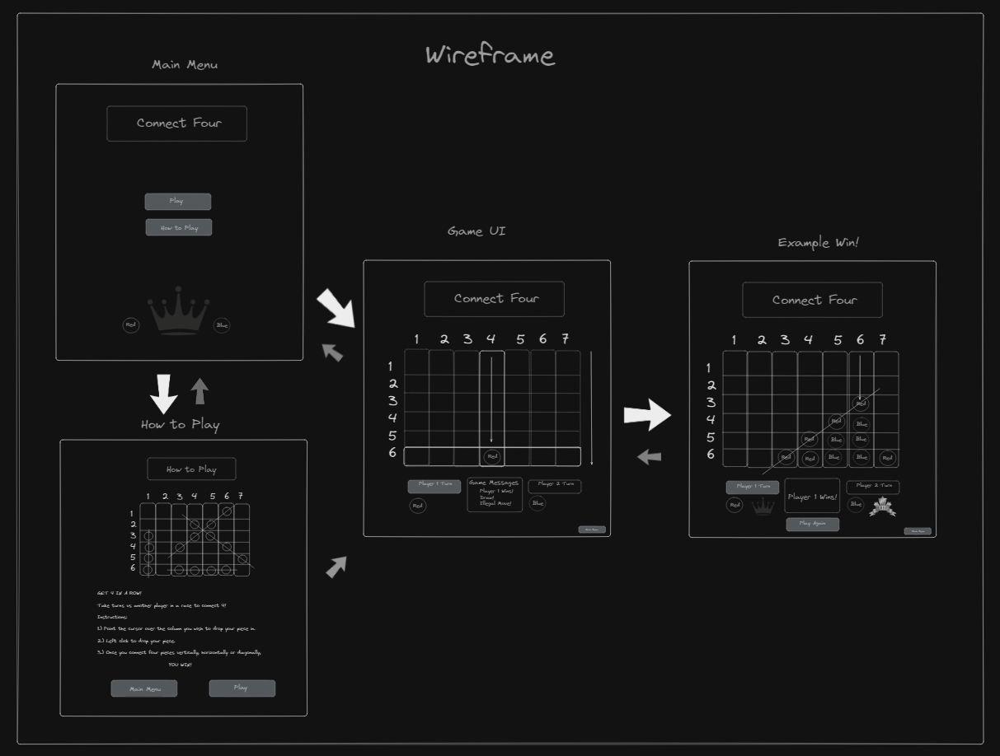
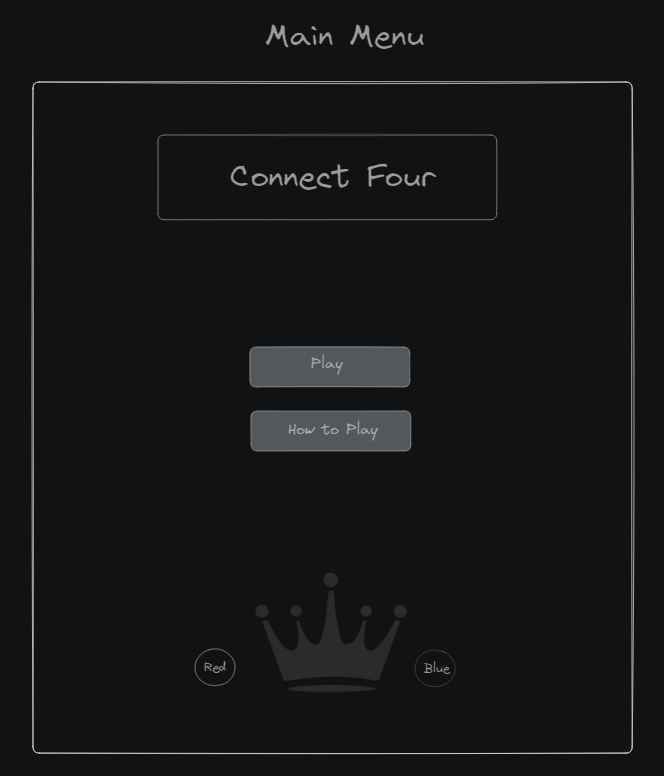
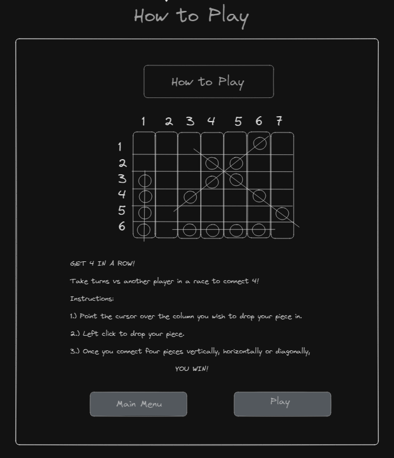
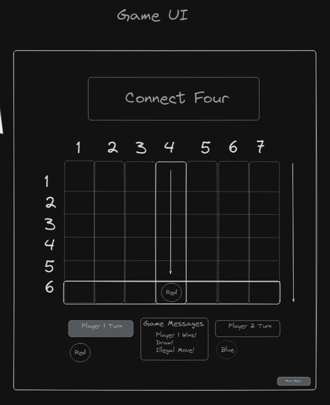
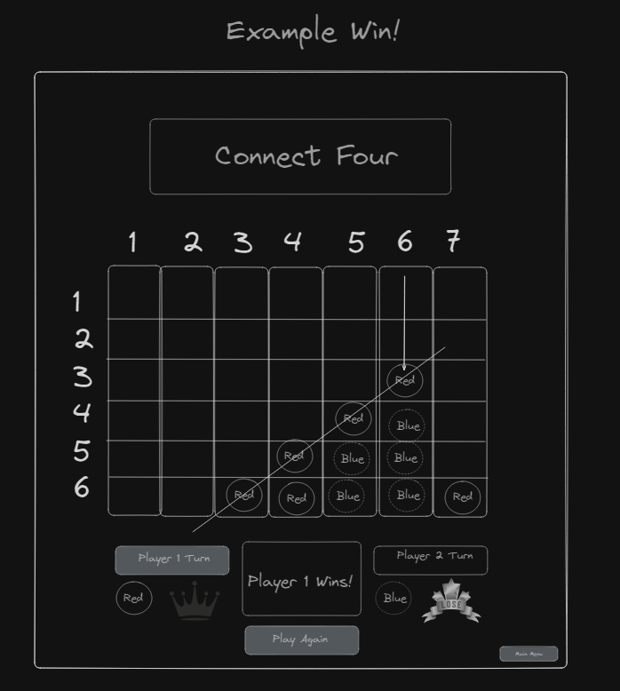

## Didier's Game - Unit 1 Project

Connect 4!
Player vs Player
(or Player vs CPU?)

## Description & Game Rules

- 2 player game
- Turn based game
- Grid based game (Board)

- This game called "Connect 4" is a turn-based 2 player game.
- This game is played on a 7x6 grid with 7 columns and 6 rows.

- Each player takes turns to place a single piece on the grid each, which must be placed only at the lowest available row of each column.
- Each piece that has been placed occupies that space in the grid until the game is over.

- To win, a player must place 4 pieces next to eachother that align either vertically, horizontally or diagonally against an opponent.
  If there are no available spaces left to place pieces, and if neither player has won, the game results in a draw.

## Wireframe

## Roadmap

- [ ] Basic Game (excluding diagonal wins, main menu page & how to play page)
- [ ] Adding Diagonal Wins
- [ ] Adding Main Menu & How to play page

## Stories (in order of priority)

- As a user, I want a 7x6 board that can be played on.
- As a user, I only want to make legal moves in order to play the game properly.
- (Making sure every piece falls to the lowest available row of each column if there is space.)

- As a user, I want to visually know when it's my turn.
- As a user, I want the game to end when someone has won.

## Optional Stories (in order of priority)

- As a user, I want to be able to restart after the game is over.
- As a user, I want to be able to go back to the main menu if I want to quit or see instructions on how to play.
- As a user, I want instructions on how to play before playing.
- As a user, I want a victory message and crown when when I win! And a lose message as well.

# To Do

### Figure out!

- [ ] JS - Come up with pseudocode for game

### Basic Setup

- [x] Create HTML + Board
- [x] Basic Flexbox layout for features under Board
- [ ] Features - Finalise display for Features under Board (Game Messages/Player Turn/Win or Loss Image)
- [x] Setup basic CSS for board properties

### Optional Setup

- [ ] (Optional) Create 'Main Menu' Page
- [ ] (Optional) Create 'How To Play' Page
- [ ] (Optional) Access to Main Menu while Game is running

### Inject Grid for Board

- [x] Come up with JS logic for injecting Grid
- [x] Inject JS Grid into HTML for Board
- [x] Create Board Array with coordinates set to (column,row)
- [ ] Make sure code is right, not just looks right

### Setting Legal Moves

- [ ] Set Starting Available Moves
- [ ] Update Available moves on board
- [ ] Don't allow moves if column is full
- [ ] Game over if no spaces left

### Place Piece

- [ ] Create coordinate system to check which space was clicked in HTML
- [ ] Place Piece only if legal
- [ ] Swap to other player after placing piece

### Check for win

- [ ] Check for win horizontally
- [ ] Check for win vertically
- [ ] (optional) Check for win diagonally (one way)
- [ ] (optional) Check for win diagonally (other way)

### Game End

- [ ] Win Message - Set a victory message for player that won
- [ ] Win/Loss Image - Display a win or loss image for both players
- [ ] Draw - Set a draw message for a tie
- [ ] (Optional) Add button to Restart Game
- [ ] (Optional) 'Play Again' button should reset board and start game again
- [ ] (Optional) Create a Line through winning pieces or Highlight pieces with thick outline

## Pseudocode

## --- Injecting Grid System Code ---

## --- Creating Coordinate System for board ---

## --- Place Piece ---

(below is outdated)

Need to setup 7 columns each with a row value, initially set to row 6
Create an Array of Columns with row values
On click, player will set a piece in the lowest row available in the column
Otherwise If no space is left in the column, click will do nothing
After each piece is placed, game should check for a win and end game if so
After a player
