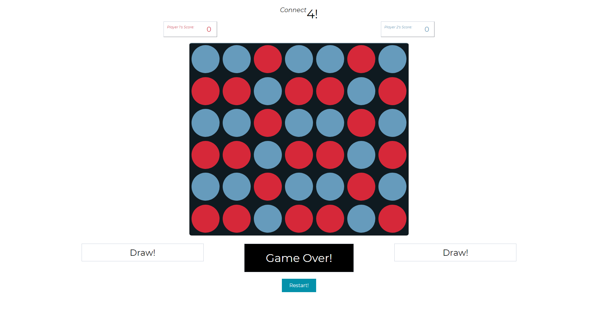

# Connect 4!

**Unit 1 Game Project**

## Getting Started!

**Here's a link to play the game:** https://didiervincent.github.io/connect-4-project/

Go head-to-head with another player and race to stack 4 in a row!

## Description & Game Rules

- Local 2 player game (PvP)
- Grid based game (7 columns, 6 rows)
- Turn based strategy game

### **Grab a friend and race in a battle to own the grid!**

- Go head-to-head with another player and race to stack 4 in a row! The
  first player to stack 4 in a row horizontally, vertically or
  diagonally, wins!

- Each player takes turns to drop a single disc in the grid into their chosen column, which then falls to the lowest row.

- Once a disc has been placed in a column, it occupies that space in the grid until the game is over! Discs will stack on top of each other.

- If there are no available spaces left to place discs in the grid, and if neither player managed to win, the game results in a draw.

(This game was invented in 1974, not by me.)

## Screenshots

**Red's Turn: (Game Start)**

**Blue's Turn:**

**Red Player Win:**

**Blue Player Win:**

**Invalid Move Game Message:**

(occurs when a player attempts to place a disc in a full column)

**Game Over - Draw Game Message:**

(occurs when grid is completely full and neither player managed to win)

## Roadmap

- [x] Basic Game (excluding diagonal wins, main menu page & how to play page)
- [x] Adding Diagonal Wins
- [x] Adding Main Menu & How to play page (added description/info boxes before game starts)
- [x] Add score system to keep track of wins

## Technology Used

HTML, CSS & JavaScript, created in Visual Studio Code

## Next Steps

- Compatibility: The game is currently only displays properly on a standard computer monitor or laptop screen - the game does not properly scale down to view and play on smaller screens. Will need some reworking in HTML & CSS, (maybe also in JavaScript).

- New Game Mode: The game currently is only playable one game mode with the classic rules of Connect 4. Looking to design a 'party' game mode with random events occuring by chance on each move. This could be things like removing previously placed discs, adding a new color disc into the grid to block players, skipping a players turn, etc.

- Online Play: The game is currently only supports local play on the same device. Looking to implement online play where two users on seperate devices could join a server/room and play against each other online!

- (Details) Highlight Winning Pieces: When a player wins, the game ends but it doesn't explicitly display where the 4 winning pieces are, (new players may get confused and have to check around). When someone wins, to increase engagement and avoid any confusion, we could highlight the 4 winning pieces when someone wins. This could be done by highlighting the winning pieces by creating a line through them, animating the colors/borders slightly, etc.

## Initial Wireframe

**Overview: Navigating from Main Menu -> How to Play -> Game**

**Main Menu:**

**How to Play:**

**Game UI:**

**Example Win:**

## Stories (in order of priority)

- [x] As a user, I want a 7x6 board that can be played on.
- [x] As a user, I only want to make legal moves in order to play the game properly.
- [x] As a user, I want the game to end when someone has won.
- [x] As a user, I want to visually know when it's my turn.

### Optional Stories (in order of priority)

- [x] As a user, I want to be able to restart after the game is over.
- [x] As a user, I want instructions on how to play before playing.
- [x] As a user, I want a victory message ~~and crown~~ when I win! And a lose message as well.
- [x] As a user, I want to be able to restart the game at any point if I want to quit or see the instructions on how to play again.

## To Do

### Organise & Rethink

- [x] Rewrite code and separate Model Functions with View Functions apart
- [x] Use an object to store data for the game state instead of using an array
- [ ] ~~(?) Use JS Classes to create a dictionary for each space?~~ (wasn't necessary)

### View Function - Create HTML & Board

- [x] Setup basic CSS for board
- [x] Inject Divs into HTML using JS
- [x] Inject Divs with ID's that can be used later as coordinates
- [x] Inject Divs with classes and style with CSS
- [x] Inject Divs into parent div with ID of 'board'

### Model Function - Using Board Database & Making Legal Moves

- [x] Create a data object that stores the game state, with nested objects inside representing columns, each with a property that shows the default lowest row available in each column (set at 5)
- [x] Function derives a div's ID (coordinates) on click
- [x] Function checks game state for default lowest row, then updates that value once a piece is placed
- [x] Function creates new property in the data object that stores info on each space (either "undefined", "red", or "blue")
- [x] Function executes another function that checks for wins
- [x] Function ends by swapping the player turn to the other player
- [x] (If column is full, do nothing)
- [x] (If game is over, do nothing)

### View Function - Show a move being played

- [x] Check player turn and change function accordingly
- [x] Using board database's default row value, change background color of the div to display the move being made
- [x] (If column is full, warn player using the game message box but do nothing)
- [x] (If game is over, do nothing)

### Model Function - Check for win

- [x] Check for win horizontally
- [x] Check for win vertically
- [x] (Optional) Check for win diagonally (one way)
- [x] (Optional) Check for win diagonally (other way)

### View - Setup Features

- [x] Create basic flexbox layout for features under grid
- [x] Turn Indicator - Show when its player 1 or player 2's turn
- [x] Turn Indicator - Change text according to who's turn it is ("waiting..." / "your move!")
- [x] Turn Indicator - Add animations to text size / background color changing
- [x] Game Messages - Display 2 different win screens when for when red or blue wins
- [x] Game Messages - Invalid Warning Message
- [x] Game Messages - Draw message
- [x] Score - Create score + update after every win
- [x] Game Info & How to Play - Show only game start and remove during game is played
- [x] Game Info & How to Play - Show again after restarting game
- [x] Features - Finalise display for Features under Board (Game Messages/Player Turn)
- [x] (Optional) Add basic animations/transitions to features

### Restart Button

- [x] (Optional) Add button to restart game at any point
- [x] (Optional) Restart button should reset all board data, features and colors on the grid so game can be played again
- [x] Create init() function

### Things to refactor

- [x] Scope: Make sure things are declared in the right scope
- [x] Remove repetitive code in checkWin() functions
- [x] Try renaming varables more appropriately & concisely
- [x] Row values are inconsistent and overly complicated: colData.r values should be set from 0-5 instead of 1-6
- [x] (adjust all functions that are affected by the above change)
- [x] ~~Rework data model: Might be overly complicated by checking and using both column.r properties and column.r(x) properties? Consider removing column.r and use only column.r(x) for functions instead. (for column.r(x), could set x = default value instead of using column.r as a default value?)~~
- [x] (The column.r(x) values are necessary)
- [x] Check if event handlers could be refactored better. (Maybe put all click handlers into 1 function?)
- [x] Add back some comments to add clarity to key lines of code
- [x] Simplify gameData, 'c' properties aren't necessary
- [x] Rename functions/variables more appropriately for future readability
- [x] Use columnRow[] instead of colData["column" + clickedColumnNum]

### Things to debug

- [ ] Error: Doesn't place piece if click is executed inbetween the circle divs (ignoring for now)
- [x] checkDiagWinTwo() logs errors on certain spaces (still works correctly though) (adjusted values)

### Optional Setup

- [ ] ~~(Optional) Create 'Main Menu' Page~~
- [ ] ~~(Optional) Create 'How To Play' Page~~
- [ ] ~~(Optional) Access to Main Menu while Game is running~~
- [x] Added Game infomation & How To Play messages on game start
- [x] Restart button lets you view the Game infomation & How To Play messages again

### (23 Aug 2024), v.2

# Refactoring App:

(will add a trello link here)

### Future Mode

- New Game Mode: Party Mode
- Online Play

### Technical Additions

#### Playable on Mobile/Tablet!

- Implement Responsive CSS to different device sizes (media query for phone/tablet/laptop etc)

#### Responsive layout for pc/laptop!

- Change layout to original design
